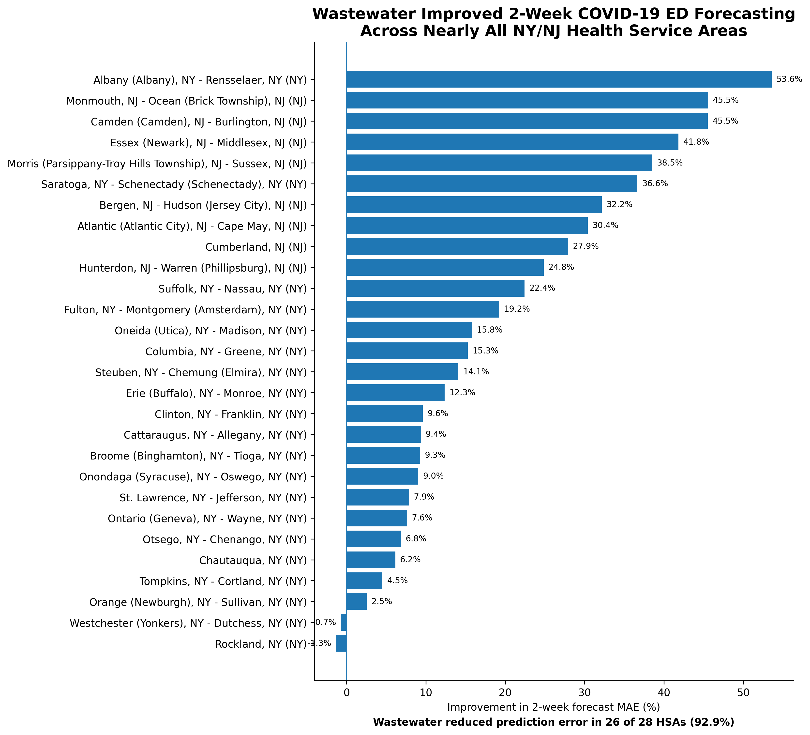
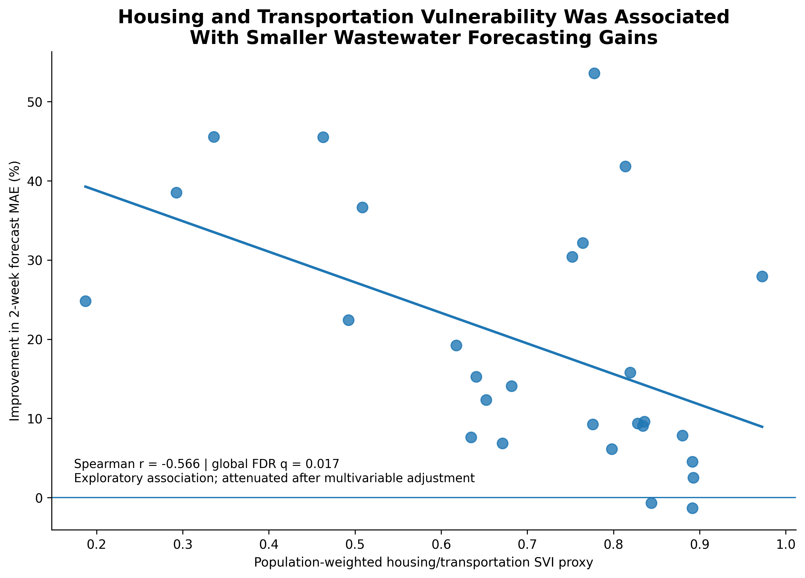
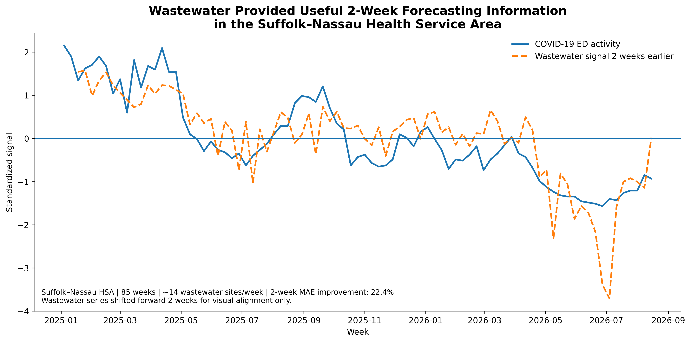

# Wastewater Equity Early Warning System

### Evaluating whether wastewater surveillance improves short-term COVID-19 emergency department forecasting—and whether that benefit is distributed equitably across communities


## Overview

Wastewater surveillance provides a population-level measure of infectious disease activity that does not depend on individual testing behavior or healthcare access.

I developed the **Wastewater Equity Early Warning System** to investigate whether SARS-CoV-2 wastewater surveillance could improve short-term forecasting of COVID-19 emergency department activity across New York and New Jersey—and whether the forecasting benefit of wastewater surveillance differed across communities with varying levels of social vulnerability.

The project integrates data from:

- CDC wastewater surveillance
- CDC emergency department surveillance
- CDC/ATSDR Social Vulnerability Index
- Census-derived population characteristics embedded within SVI

Using Python, I built a longitudinal HSA-level analytic dataset, evaluated wastewater lead-time patterns, developed out-of-sample forecasting models, and examined whether wastewater-related forecasting gains varied according to social vulnerability.

---

## Research Questions

This project was designed around three questions:

1. **Does SARS-CoV-2 wastewater activity provide useful information about future COVID-19 emergency department activity?**

2. **Does adding wastewater improve forecasting beyond what current emergency department activity already tells us?**

3. **Is the forecasting benefit of wastewater surveillance equally distributed across communities with different levels of social vulnerability?**

---

# Key Findings

## 1. Wastewater improved out-of-sample forecasting

Adding wastewater surveillance to models that already included current COVID-19 emergency department activity reduced prediction error at both forecast horizons.

| Forecast Horizon | MAE Improvement | RMSE Improvement |
|---|---:|---:|
| **1 week** | **14.8%** | **10.9%** |
| **2 weeks** | **18.0%** | **13.3%** |

Wastewater improved forecasting in:

- **26 of 28 Health Service Areas (92.9%)** at the 1-week horizon
- **26 of 28 Health Service Areas (92.9%)** at the 2-week horizon

Median HSA-level improvement in mean absolute error was approximately:

- **11.7% at 1 week**
- **14.7% at 2 weeks**

These findings suggest that wastewater contained useful predictive information beyond contemporaneous emergency department activity.

---

## 2. The forecasting benefit was geographically widespread

The improvement associated with wastewater was not driven by only a small number of Health Service Areas.

Across the 28-HSA analytic sample, wastewater reduced 2-week forecast error in **92.9% of HSAs**, with some areas experiencing reductions in mean absolute error greater than 40%.



---

## 3. Overall social vulnerability was not clearly associated with forecasting benefit

The primary equity analysis examined whether wastewater-related forecasting improvement varied according to an HSA-level proxy for overall social vulnerability.

At the 2-week horizon:

- Pearson correlation: **r = -0.259, p = 0.183**
- Spearman correlation: **r = -0.273, p = 0.160**

The direction of the association suggested somewhat smaller forecasting gains in more vulnerable areas, but the evidence was not statistically clear.

Overall, the results did **not provide strong evidence that wastewater forecasting benefit systematically differed according to overall SVI**.

---

## 4. Housing and transportation vulnerability showed an exploratory pattern

Among the individual SVI domains, **housing and transportation vulnerability** showed the strongest relationship with wastewater forecasting benefit.

At the 2-week horizon:

- Pearson correlation: **r = -0.491**
- Spearman correlation: **r = -0.566**
- Global FDR-adjusted Spearman **q = 0.017**

Higher housing and transportation vulnerability was associated with smaller wastewater-related improvements in forecast accuracy.

However, this relationship was attenuated after multivariable adjustment for:

- baseline forecasting error
- HSA population
- wastewater monitoring density
- state

The housing and transportation result is therefore interpreted as **exploratory rather than evidence of an independent causal effect**.



---

# Study Population

The initial wastewater dataset contained:

- **18,861 wastewater measurements**
- **192 wastewater surveillance sites**
- New York and New Jersey
- January 2025 through August 2026

Wastewater sites were eligible for the primary analysis if they:

- had at least **40 measurements**
- had monitoring spanning at least **365 days**
- represented a **single-county sewershed**

After applying these criteria:

- **169 wastewater sites** were retained
- **72 counties** were represented
- wastewater data mapped to **29 Health Service Areas**

One HSA was excluded from the final clinical analysis because usable COVID-19 emergency department activity was unavailable throughout the study period.

The final analytic dataset contained:

- **28 Health Service Areas**
- **2,398 HSA-week observations**
- up to **87 weeks of surveillance data**

---

# Data Sources

## CDC National Wastewater Surveillance System

Wastewater surveillance data included information on:

- wastewater surveillance site
- state
- county FIPS
- counties served
- population served
- sample collection date
- sample type
- sample matrix
- SARS-CoV-2 concentration
- pathogen detection status

Because raw wastewater concentrations can differ substantially across wastewater systems, laboratories, and sampling procedures, raw values were not directly compared across sites.

---

## CDC Emergency Department Surveillance

COVID-19 emergency department activity was obtained from CDC emergency department surveillance data.

The primary clinical outcome was:

> **Percent of emergency department visits associated with COVID-19**

Emergency department data were represented at the **Health Service Area (HSA)** level.

Because identical HSA-level estimates appeared on multiple county rows within the CDC dataset, the data were collapsed to one observation per HSA per week before analysis.

---

## CDC/ATSDR Social Vulnerability Index

The project used the **2022 CDC/ATSDR Social Vulnerability Index**.

County-level measures included:

- Overall SVI
- Socioeconomic Status
- Household Characteristics
- Racial and Ethnic Minority Status
- Housing Type and Transportation

Because the clinical outcome was measured at the HSA level, county-level SVI values were combined using population-weighted averages.

The resulting variable is referred to throughout the project as an:

> **HSA-level population-weighted SVI proxy**

It is not an official CDC HSA-level SVI measure.

---

# Data Processing

## Wastewater site eligibility

Wastewater sites were evaluated for longitudinal coverage.

Sites were retained when they met all three primary criteria:

```text
≥ 40 wastewater measurements
AND
≥ 365 days between first and last measurement
AND
single-county service area
```

Multi-county wastewater systems were excluded from the primary analysis to avoid assigning the same wastewater signal to multiple counties.

---

## Wastewater transformation

Raw SARS-CoV-2 wastewater concentrations were log-transformed:

```python
np.log1p(pcr_target_avg_conc)
```

Measurements were then standardized within wastewater site.

This allowed wastewater activity to be interpreted relative to each site's own historical distribution rather than comparing raw concentration scales across treatment plants.

For forecasting analyses, wastewater standardization parameters were estimated using **training-period observations only** to prevent information from the future test period from influencing model inputs.

---

## Weekly aggregation

The wastewater data were aggregated in two stages.

### Site-week level

Multiple measurements collected from the same wastewater site during the same week were averaged.

### HSA-week level

Standardized site-level signals were then averaged within Health Service Areas.

This created one wastewater surveillance signal per:

```text
HSA × week
```

---

# Initial Lead-Time Analysis

The initial analysis compared COVID-19 ED activity with wastewater signals measured:

- during the same week
- 1 week earlier
- 2 weeks earlier
- 3 weeks earlier
- 4 weeks earlier

Across HSAs, the strongest average and median correlations generally occurred within approximately **1–2 weeks**.

However, correlations across wastewater and ED **levels** can partly reflect shared epidemic waves and seasonal patterns.

To test this, the analysis was repeated using exact week-to-week changes.

The change-on-change correlations were close to zero across the 0–4 week window.

This suggested that simple lagged correlation alone was not sufficient evidence of an early-warning relationship.

Rather than relying on the stronger level-based correlations, the project therefore moved to a more rigorous question:

> **Does adding wastewater improve prediction of future ED activity beyond what current ED activity already predicts?**

---

# Forecasting Framework

## Temporal validation

A time-based train/test design was used rather than a random split.

### Training period

**January 4, 2025 – April 11, 2026**

- 67 weeks

### Held-out test period

**April 18, 2026 – August 29, 2026**

- 20 weeks

The final 20 weeks were kept completely separate from model development and used as unseen future observations.

Training-period wastewater statistics were also used for standardization to prevent data leakage.

---

## Baseline model

The baseline model predicted future COVID-19 emergency department activity using:

```text
Current COVID-19 ED activity
+
Health Service Area
```

Conceptually:

```text
Future ED activity
=
Current ED activity
+
HSA
```

---

## Wastewater-enhanced model

The enhanced model added the current wastewater signal:

```text
Future ED activity
=
Current ED activity
+
Wastewater signal
+
HSA
```

Separate models were evaluated for:

- **1-week-ahead forecasting**
- **2-week-ahead forecasting**

---

# Model Evaluation

Forecast performance was evaluated using:

- **Mean Absolute Error (MAE)**
- **Root Mean Squared Error (RMSE)**
- **R²**

The primary metric of interest was the **reduction in prediction error after wastewater was added to the baseline model**.

Although test-period R² values were negative, indicating limited absolute model generalization during the held-out period, the wastewater-enhanced models consistently reduced MAE and RMSE relative to the baseline models.

The project therefore focuses on:

> **incremental predictive value**

rather than claiming that the models provide highly accurate absolute forecasts.

---

# Forecasting Results

## 1-week horizon

Adding wastewater produced approximately:

- **14.8% reduction in MAE**
- **10.9% reduction in RMSE**

Wastewater improved forecast accuracy in:

**26 of 28 HSAs**

---

## 2-week horizon

Adding wastewater produced approximately:

- **18.0% reduction in MAE**
- **13.3% reduction in RMSE**

Wastewater improved forecast accuracy in:

**26 of 28 HSAs**

The larger improvement at the 2-week horizon suggests that wastewater may be particularly useful when clinical activity must be anticipated further in advance.


---

# HSA-Level Forecast Performance

Forecasting benefit varied considerably across Health Service Areas.

At the 2-week horizon, the mean HSA-level improvement in MAE was approximately **19.5%**, while the median improvement was approximately **14.7%**.

Only two HSAs showed slight worsening after wastewater was added.

This geographic consistency strengthened the interpretation that the overall result was not being driven by a small number of unusually high-performing regions.


---

# Equity Analysis

## Primary equity analysis

The primary equity question was:

> **Does wastewater provide equal forecasting benefit across communities with different levels of overall social vulnerability?**

The association between overall HSA SVI and forecast improvement was modest and negative but not statistically clear.

### 1-week horizon

- Pearson: **r = -0.193, p = 0.326**
- Spearman: **r = -0.186, p = 0.343**

### 2-week horizon

- Pearson: **r = -0.259, p = 0.183**
- Spearman: **r = -0.273, p = 0.160**

The analysis therefore did not find strong evidence that wastewater forecasting benefit differed systematically according to overall social vulnerability.

---

# Exploratory SVI Domain Analysis

The four SVI domains were evaluated separately as exploratory analyses.

The strongest relationship involved the **Housing Type and Transportation** domain.

At the 2-week horizon:

```text
Pearson r  = -0.491
Spearman r = -0.566
Global FDR-adjusted Spearman q = 0.017
```

The negative relationship suggested that higher housing and transportation vulnerability was associated with smaller gains from wastewater-enhanced forecasting.


However, after accounting for baseline forecast error, population, wastewater surveillance density, and state, the housing/transportation association was attenuated.

For example, in the adjusted 2-week model:

```text
Housing/transportation coefficient = -11.28
p = 0.416
```

The finding is therefore treated as exploratory.

---

# Example: Suffolk–Nassau Health Service Area

The Suffolk–Nassau HSA provides a representative example of the forecasting framework.

This area included:

- **85 weeks** of paired surveillance data
- approximately **14 wastewater sites per week**
- **22.4% improvement in 2-week MAE** after wastewater was added

The wastewater series below has been shifted forward by two weeks for visualization so that earlier wastewater activity can be visually compared with later COVID-19 ED activity.



The figure is intended to illustrate the forecasting concept rather than imply perfect alignment between wastewater and clinical activity.

---

# Figures

## Figure 1

**Out-of-sample forecasting improvement after adding wastewater surveillance**


---

## Figure 2

**2-week forecasting improvement across Health Service Areas**


---

## Figure 3

**Housing and transportation vulnerability versus 2-week forecasting benefit**


---

## Figure 4

**Representative wastewater and clinical surveillance time series**


---

# Repository Structure

```text
Wastewater-Equity-Early-Warning-System/
│
├── README.md
├── LICENSE
├── .gitignore
│
├── notebooks/
│   └── Wastewater_Equity_Early_Warning.ipynb
│
├── data/
│   ├── final_hsa_weekly_analysis.csv
│   ├── hsa_forecast_performance_1week.csv
│   ├── hsa_forecast_performance_2week.csv
│   ├── hsa_svi_proxy.csv
│   ├── equity_analysis_1week.csv
│   └── equity_analysis_2week.csv
│
├── results/
│   ├── model_performance_summary.csv
│   └── svi_domain_equity_results.csv
│
└── figures/
    ├── figure1_forecast_improvement.png
    ├── figure2_hsa_forecast_improvement.png
    ├── figure3_housing_transport_equity.png
    └── figure4_suffolk_nassau_timeseries.png
```

---

# Technical Skills Demonstrated

## Data Analysis

- Python
- pandas
- NumPy
- SciPy
- statsmodels
- scikit-learn

## Data Engineering

- REST API extraction
- multi-source data integration
- geographic crosswalks
- longitudinal data cleaning
- weekly aggregation
- feature engineering
- missing-data assessment

## Modeling

- time-series lag analysis
- temporal train/test validation
- linear regression
- out-of-sample forecasting
- MAE and RMSE evaluation
- HSA-specific performance analysis
- leakage prevention

## Epidemiology and Public Health

- infectious disease surveillance
- wastewater epidemiology
- emergency department surveillance
- social vulnerability analysis
- health equity
- geographic surveillance systems

## Statistical Methods

- Pearson correlation
- Spearman rank correlation
- multiple-comparison correction
- false discovery rate adjustment
- robust standard errors
- sensitivity analysis

## Visualization

- matplotlib
- ranked performance plots
- time-series visualization
- equity scatterplots
- recruiter-facing analytical storytelling

---

# Methodological Strengths

Several design choices were used to strengthen the analysis.

### Temporal rather than random validation

The final 20 weeks were held out as future observations rather than randomly sampled from throughout the study period.

### Training-only standardization

Wastewater normalization for the forecasting models was estimated using training data only, reducing the risk of information leakage.

### Exact calendar lags

Lead variables were created using exact calendar-week alignment rather than simple row shifting, preventing missing weeks from being incorrectly interpreted as one-week lags.

### Within-site wastewater normalization

Wastewater concentrations were standardized relative to each site's own history rather than comparing raw concentrations across treatment plants.

### HSA-level clinical alignment

County wastewater data were mapped to Health Service Areas to match the geographic level of the available emergency department surveillance outcome.

### Validation of initial findings

The project did not rely solely on favorable lag correlations.

When change-on-change analyses showed that simple correlations did not provide sufficient evidence of short-term prediction, the analytic strategy was updated to evaluate true out-of-sample forecast improvement.

---

# Limitations

This analysis has several important limitations.

First, wastewater sampling frequency and monitoring density differed across surveillance sites and Health Service Areas.

Second, wastewater systems do not necessarily align perfectly with county or Health Service Area boundaries.

Third, multi-county wastewater sites were excluded from the primary analysis to avoid ambiguous geographic assignment, which may reduce geographic coverage.

Fourth, county-level SVI measures were population-weighted to create an HSA-level proxy. This is not an official CDC HSA-level SVI measure and may mask within-HSA heterogeneity.

Fifth, the final equity analysis included only **28 HSAs**, limiting statistical power for geographic comparisons and multivariable models.

Sixth, negative test-period R² values indicate that the forecasting models had limited absolute generalization during the held-out period, even though wastewater meaningfully reduced error relative to the baseline model.

Seventh, wastewater and emergency department activity may both be influenced by unmeasured factors such as circulating variants, immunity, healthcare-seeking behavior, seasonality, and local surveillance practices.

Finally, this is an observational analysis. Associations between community characteristics and wastewater forecasting performance should not be interpreted causally.

---

# Conclusion

Across 28 New York and New Jersey Health Service Areas, wastewater surveillance provided meaningful incremental information for short-term forecasting of COVID-19 emergency department activity.

Adding wastewater reduced out-of-sample prediction error at both **1-week and 2-week horizons** and improved forecasts in **92.9% of Health Service Areas**.

The strongest overall evidence supported the **predictive value of wastewater surveillance**.

The equity analysis did not identify a statistically clear relationship between overall social vulnerability and wastewater forecasting benefit. Exploratory results suggested that housing and transportation vulnerability may be associated with smaller forecasting gains, although this relationship weakened after adjustment.

Together, the findings highlight an important question for modern public health surveillance:

> **It is not enough to ask whether an early-warning system works. We should also ask where it works, how much value it adds, and whether that value is distributed equitably across communities.**
