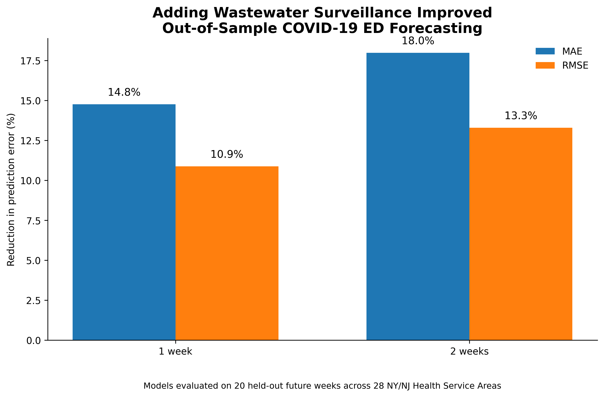

# Wastewater Equity Early Warning System

### Can wastewater surveillance improve short-term COVID-19 forecasting—and does that benefit reach communities equally?

Wastewater surveillance can detect infectious disease activity at the population level without relying on individual testing or healthcare utilization.

I built the **Wastewater Equity Early Warning System** to evaluate whether SARS-CoV-2 wastewater surveillance improves short-term prediction of COVID-19 emergency department activity across New York and New Jersey, and whether that forecasting benefit differs according to community social vulnerability.

The project integrates **CDC wastewater surveillance, CDC emergency department data, and the CDC/ATSDR Social Vulnerability Index** using Python.

---

## Key Findings

Adding wastewater surveillance to models that already included current COVID-19 emergency department activity improved predictions of future ED activity.

| Forecast Horizon | MAE Improvement | RMSE Improvement |
|---|---:|---:|
| 1 week | **14.8%** | **10.9%** |
| 2 weeks | **18.0%** | **13.3%** |

Wastewater improved forecast accuracy in:

- **26 of 28 Health Service Areas (92.9%)** at the 1-week horizon
- **26 of 28 Health Service Areas (92.9%)** at the 2-week horizon

The median HSA-level improvement in MAE was approximately:

- **11.7% at 1 week**
- **14.7% at 2 weeks**

---

## Figure 1: Forecast Improvement



Adding wastewater information reduced both mean absolute error and root mean squared error in held-out future data.

---

## Study Area and Analytic Sample

The final analysis included:

- **169 eligible wastewater surveillance sites**
- **72 counties**
- **28 Health Service Areas**
- **2,398 HSA-week observations**
- New York and New Jersey
- January 2025 through August 2026

Wastewater sites were eligible for the primary analysis if they:

- had at least **40 wastewater measurements**
- were monitored across at least **365 days**
- represented a **single-county sewershed**

Multi-county wastewater sites were excluded from the primary analysis to avoid assigning the same wastewater signal to multiple counties.

---

## Data Sources

### CDC National Wastewater Surveillance System

SARS-CoV-2 wastewater data included:

- wastewater site
- county FIPS
- population served
- sample date
- sample characteristics
- SARS-CoV-2 concentration

### CDC NSSP Emergency Department Surveillance

Weekly COVID-19 emergency department activity was evaluated at the **Health Service Area (HSA)** level.

The clinical outcome was the:

> **Percent of emergency department visits associated with COVID-19**

### CDC/ATSDR Social Vulnerability Index

The **2022 Social Vulnerability Index (SVI)** was used to evaluate community vulnerability.

County-level SVI values were population-weighted within each Health Service Area to construct an **HSA-level SVI proxy**.

Domains included:

- Overall Social Vulnerability
- Socioeconomic Status
- Household Characteristics
- Racial and Ethnic Minority Status
- Housing Type and Transportation

---

## Methods

### Wastewater preprocessing

Raw wastewater concentrations were log-transformed and standardized within each wastewater site.

This was important because raw wastewater concentrations are not directly comparable across treatment plants.

For forecasting analyses, standardization parameters were calculated using **training-period observations only** to prevent data leakage.

### Weekly wastewater signal

Multiple samples from the same wastewater site during the same week were averaged.

Site-level standardized signals were then aggregated within each Health Service Area to create a weekly HSA wastewater measure.

### Lead-time analysis

Wastewater signals from:

- the same week
- 1 week earlier
- 2 weeks earlier
- 3 weeks earlier
- 4 weeks earlier

were compared with COVID-19 ED activity.

Level-based correlations suggested a broad **1–2 week early-warning window**.

However, correlations between week-to-week changes in wastewater and week-to-week changes in ED activity were close to zero, suggesting that some of the initial relationship reflected shared epidemic patterns.

Because of this, the primary analysis was shifted from simple lag correlations to **out-of-sample forecasting**.

---

## Forecasting Framework

A temporal train/test split was used rather than a random split.

### Training Period

**January 4, 2025 – April 11, 2026**

### Held-Out Test Period

**April 18, 2026 – August 29, 2026**

The final **20 weeks** were reserved as unseen future observations.

Two models were compared.

### Baseline Model

```text
Future COVID ED activity
=
Current COVID ED activity
+
Health Service Area
